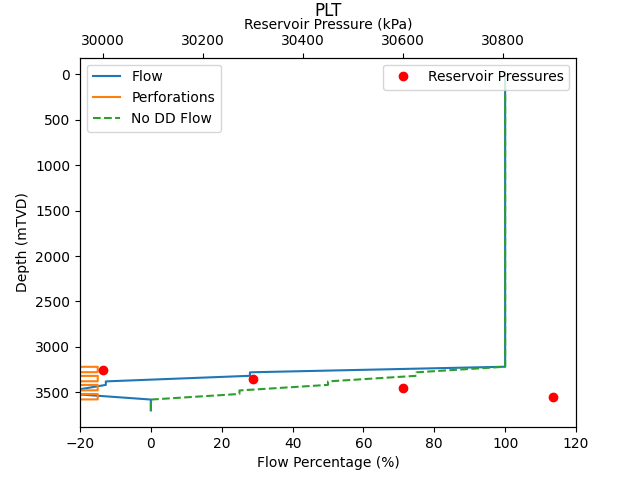

# reservoir_plt
PLT flow calculations for multi-zone reservoir.

# INPUTS
Put kh values into "kh_inputs.csv". \
Pressure, skin, and perforation intervals for each zone are put into "zone_inputs.csv". \
Other inputs are in the Python file "plt_approx.py".

# EXAMPLE
Example output for the values already in the relevant files is shown below:


# THE MATH
```math
\displaylines{
\text{Total Flow} \\
Q_T=\sum_{n=1}^{m}{Q_n} \quad (1)\\ \\
\text{Hydrostatic Pressure} \\
P_{wfn}=P_{wf1} + \rho g z_n \quad (2) \\ \\
\text{Darcy's Law} \\
Q_n=\frac{2 \pi k h_n (P_{rn}-P_{wfn})}{\mu \beta (\ln{(r_e/r_w)}+S_n)} \quad (3) \\ \\
\text{Let} \quad x_n=\frac{2 \pi}{\mu \beta (\ln{(r_e/r_w)}+S_n)} \quad (4) \\ \\
\text{Sub (4) into (3)} \\
Q_n=k h_n x_n (P_{rn}-P_{wfn}) \quad (5) \\ \\
\text{Sub (2) into (5)} \\
Q_n=k h_n x_n (P_{rn}-P_{wf1}-\rho g z_n) \quad (6) \\ \\
\text{Expand} \\
Q_n=k h_n x_n P_{rn}-k h_n x_n P_{wf1}-k h_n x_n \rho g z_n \quad (7) \\ \\
\text{Sub (7) into (1)} \\
Q_T=\sum_{n=1}^{m}{(k h_n x_n P_{rn}-k h_n x_n P_{wf1}-k h_n x_n \rho g z_n)} \quad (8) \\ \\
\text{Rearrange} \\
Q_T-\sum_{n=1}^{m}{k h_n x_n P_{rn}}+\rho g \sum_{n=1}^{m}{k h_n x_n z_n}=-P_{wf1} \sum_{n=1}^{m}{k h_n x_n} \\
P_{wf1}=\frac{\sum\limits_{n=1}^{m}{k h_n x_n P_{rn}}-\rho g \sum\limits_{n=1}^{m}{k h_n x_n z_n}-Q_T}{\sum\limits_{n=1}^{m}{k h_n x_n}} \quad (9) \\ \\
}
```
Can now use equation (9) to solve for Pwf1, then equation (2) to solve for Pwf in each zone, and equation (3) to solve for Q in each zone.
